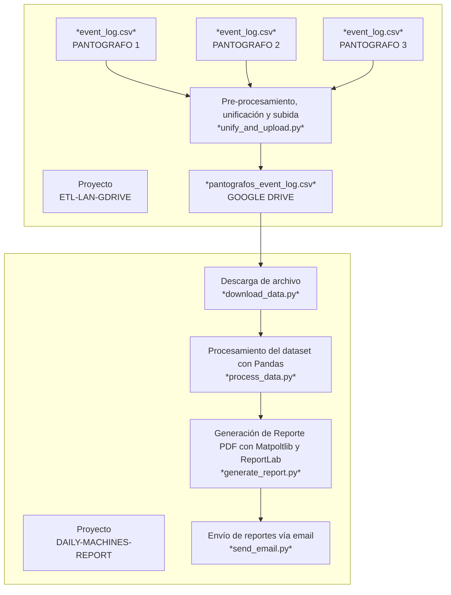
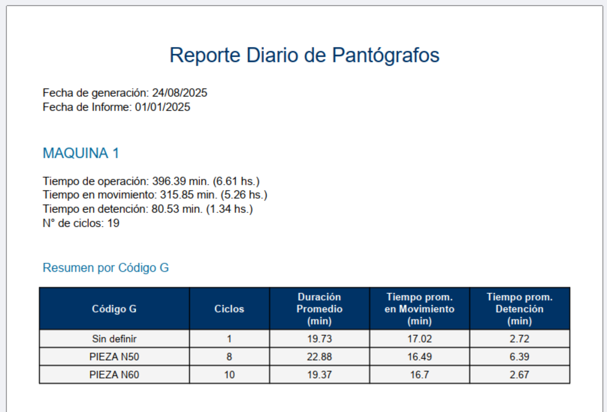
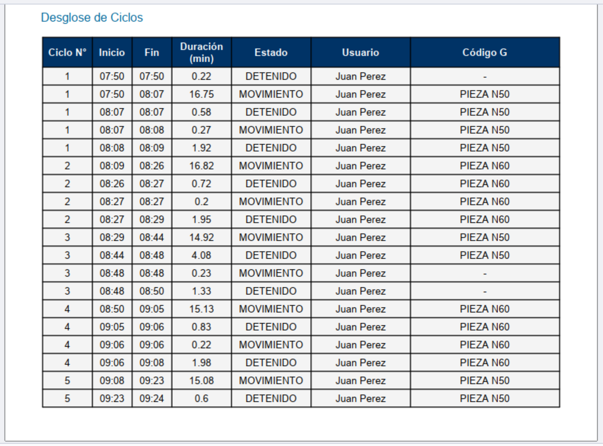
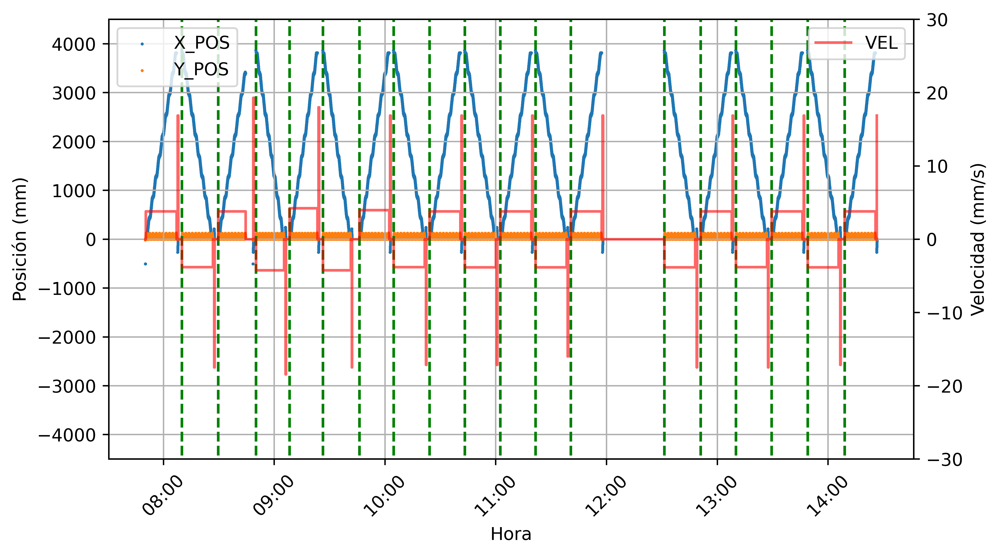
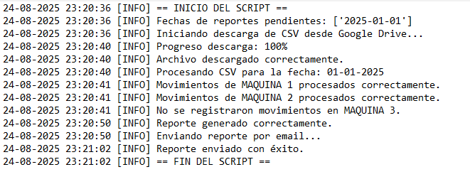

# 📈 Análisis de CSV y Reporte Automático


---

## 📑 Tabla de Contenidos
- [📈 Análisis de CSV y Reporte Automático](#-análisis-de-csv-y-reporte-automático)
  - [📑 Tabla de Contenidos](#-tabla-de-contenidos)
  - [🎯 Objetivo del Proyecto](#-objetivo-del-proyecto)
  - [📂 Dataset](#-dataset)
  - [➡️ Pipeline de datos](#️-pipeline-de-datos)
  - [⚙️ Funcionamiento](#️-funcionamiento)
  - [📊 Resultados](#-resultados)
  - [🚀 Ejecución](#-ejecución)
  - [🔄 Automatización](#-automatización)
  - [🛠 Tecnologías](#-tecnologías)
  - [📜 Licencia](#-licencia)

---

## 🎯 Objetivo del Proyecto

El objetivo de este proyecto es automatizar el procesamiento de un **archivo.csv** que se encuentra almacenado en **Google Drive** y la posterior generación de un **reporte.pdf** que es enviado vía **correo electrónico** de forma diaria.

---

## 📂 Dataset
- **Fuente**: El dataset es generado durante la operación de Pantógrafos de Corte CNC en una planta industrial, a partir de otro script que releva los eventos generados (movimientos, detenciones y cambios de velocidad) en cada máquina y los condensa diariamente en un solo archivo (ver proyecto [etl-lan-gdrive](https://github.com/gastongritti/etl-lan-gdrive)).
- **Formato**: CSV con 7 columnas  
- **Variables relevantes**:  
  - `DATE_TIME`: fecha y hora del evento (cambio de coordenadas X Y)
  - `G-CODE`: programa de corte del producto que se está procesando.
  - `X_POS`: coordenada actual en el eje horizontal de la máquina.
  - `Y_POS`: coordenada actual en el eje vertical de la máquina.
  - `FRO`: variación porcentual de la velocidad de avance.
  - `USER`: nombre de la persona que se encuentra operando la máquina.
  - `MACHINE`: identificación de la máquina.
- **Volumen**: de 10.000 a 15.000 registros nuevos diarios   

---

## ➡️ Pipeline de datos


---

## ⚙️ Funcionamiento
1. **Comparación de fechas:** se verifica que la fecha del último reporte `last_report_date` sea anterior a la fecha de la última sincronización del archivo CSV en GDrive `last_sync_date`, antes de dar inicio a cualquier otra operación. Si se cumple la condición se descarga el archivo y ejecuta la posterior secuencia para cada fecha de reporte pendiente. Para el presente caso actual, los reportes deben ser enviados de lunes a sábados, pero esta configuración puede ser modificada en `config.yaml`, con los valores de `report_days`.
2. **Descarga de datos:** se llama a la función `download_csv_from_gdrive()` pasándole como argumento el `file_id` del archivo en GDrive, el nombre a asignar al archivo descargado `INPUT_CSV_FILE` y el archivo que contiene las credenciales de acceso `CREDENTIALS_FILE`. Estos tres parámetros son establecidos en `config.yaml`.
3. **Procesamiento de CSV:** se llama a la función `process_csv()` entregándole el nombre del archivo a procesar `INPUT_CSV_FILE`, la información de las máquinas incluídas en el análisis `MACHINES` y la fecha para la cual se debe generar el reporte `report_date`. De esta forma la función luego de ejecutar una serie de procedimientos de filtrado, limpieza y agrupamiento de los datos, devuelve `machines_dateframes` que contiene la información necesaria para generar el reporte agrupado por máquina para la fecha específicada. 
4. **Generación de reporte:** si se registraron movimientos en alguna de las máquinas para la fecha de reporte, se procede a ejecutar la función `generate_pdf_report()` pasándole la información a utilizar contenida en `machines_dateframes`, el nombre a asignar al archivo PDF generado `report_file` y la fecha de reporte `report_date`. En caso de no haber encontrado registros de eventos para ninguna máquina se omite este paso.
5. **Envío de email:** se procede a generar y enviar un correo eléctronico con los resultados del análisis para la fecha de reporte dada a través de la función `send_email_report()`, pasándole el archivo de reporte a adjuntar `report_file` en caso de que éste se haya generado efectivamente, o un mensaje notificando que no se han registrado movimientos para la fecha, si ese fuera el caso. Además se pasa a la función la configuración del `SMTP` establecida en el archivo `config.yaml`.
6. **Actualización de último reporte:** luego del envío de cada email se procede a actualizar la fecha de último reporte `last_report_date` en el archivo de configuraciones `config.yaml`. Lo cual permite evitar el envío duplicado de reportes para un mismo día.
7. **Eliminación de archivos temporales:** en este caso de aplicación se opta por eliminar los archivos generados en la PC local durante la ejecución del script, a los fines de mantener unificado el alojamiento de estos en GDrive y Gmail.

---

## 📊 Resultados
La ejecución automática del script le permite a las partes interesadas contar diariamente con un resumen sintetizado de la operación de varias máquinas a lo largo de toda una jornada. Lo cual facilita el control de la producción y genera una documentación histórica de mucho potencial para anticiparse a desviaciones futuras.

A continuación se pueden observar algunas capturas de un reporte generado a modo de ejemplo.



También se presenta un ejemplo del gráfico incluído en los reportes donde se representan las coordenadas X e Y de la máquina a lo largo de una jornada, velocidades de desplazamiento y cambios de dirección (ciclos).


[Ejemplo de reporte completo disponible para descarga en PDF.](reports/example_report.pdf)

En paralelo a la ejecución del script se genera el archivo  `daily_report.log` que registra la secuencia de procedimientos que se realizan, así como los errores que puedan llegar a surgir.


---

## 🚀 Ejecución
1. Clonar el repositorio e instalar dependencias:
    ```bash
    git clone https://github.com/gastongritti/daily-machines-report.git

    python -m venv venv
    venv\Scripts\activate      # Windows
    source venv/bin/activate   # Linux/Mac
    pip install -r requirements.txt
    ```
2. Obtener el archivo `service_account.json` creando una cuenta de servicio en [Google Cloud Console](https://console.cloud.google.com/)
3. Disponer archivo CSV en Google Drive y compartirlo con la cuenta de servicio creada.
4. Cargar el `id_file` de GDrive en el archivo `config.yaml`
5. Configurar datos del `SMTP` con email de usuario (origen), contraseña de aplicación y emails de receptores.
6. Ejecutar el script principal:
    ```bash
    python main.py
    ```

---

## 🔄 Automatización
Para configurar la ejecución programada con Task Scheduler de Windows se puede utilizar el archivo `run_script_example.bat` especificando correctamente la carpeta donde se tiene almacenado el proyecto.

---

## 🛠 Tecnologías
- **Python** 3.10+
- **Pandas** → procesamiento de datos
- **Numpy** → cálculos numéricos
- **MatplotLib** → visualización de datos
- **ReportLab** → generación de informes
- **Google API Client** → descarga de archivos desde GDrive
- **SMTPLib** → envío de correos electrónicos

---

## 📜 Licencia

Este proyecto está bajo licencia MIT.
